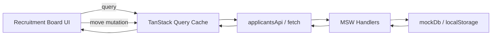

# 채용 파이프라인 보드 개발 명세

## 0. 기술 기준안

- 빌드 도구: Vite
- UI: React + TypeScript strict
- 서버 상태: TanStack Query
- mock API: MSW(Mock Service Worker) + Fetch API
- mock 영속 저장소: `localStorage`
- 스타일: CSS Modules
- 테스트: Vitest + React Testing Library + MSW Node server
- 전역 클라이언트 상태 라이브러리: 사용하지 않음

### 선택 이유

- 서버 렌더링·라우팅이 필요 없는 단일 화면이므로 Next.js보다 Vite 기반 SPA가 과제 핵심에 집중하기 쉽다.
- 지원자 목록은 서버 상태로 보고 TanStack Query 캐시를 단일 진실 공급원으로 사용한다.
- 검색어, 직무 필터, 상세 패널 선택 ID, 알림은 화면 로컬 UI 상태로 충분하다.
- MSW로 실제 `fetch` 호출 경계를 유지하면서 지연·실패·HTTP 오류를 표현한다.
- 드래그앤드롭 대신 네이티브 선택 컨트롤과 버튼을 사용해 접근성·테스트·오류 재현 비용을 줄인다.

## 1. 전체 구조



### 데이터 흐름

1. 앱 시작 시 MSW worker를 등록한다.
2. `useApplicantsQuery`가 `GET /api/applicants`를 호출한다.
3. MSW handler가 200~800ms 지연과 실패 여부를 결정한다.
4. 성공 시 `mockDb`에서 데이터를 읽어 반환한다.
5. 이동 submit은 확인 dialog를 열고, 확인 전에는 mutation을 호출하지 않는다.
6. 확인 시 Query cache를 먼저 수정하고 `PATCH /api/applicants/:id/stage`를 호출한다.
7. 성공하면 응답 엔티티를 캐시에 병합하고, 실패하면 해당 지원자의 이전 엔티티만 복원한다.

## 2. 권장 폴더 구조

```text
.
├─ AGENTS.md
├─ README.md
├─ PROMPTS.md
├─ DECISIONS.md
├─ docs/
│  ├─ ASSIGNMENT.md
│  ├─ PRD.md
│  ├─ TECH_SPEC.md
│  └─ IMPLEMENTATION_AND_COMMIT_PLAN.md
├─ public/
│  └─ mockServiceWorker.js
├─ src/
│  ├─ app/
│  │  ├─ App.tsx
│  │  └─ AppProviders.tsx
│  ├─ features/
│  │  └─ recruitment-board/
│  │     ├─ api/
│  │     │  └─ applicantsApi.ts
│  │     ├─ components/
│  │     │  ├─ RecruitmentBoard.tsx
│  │     │  ├─ BoardToolbar.tsx
│  │     │  ├─ StageColumn.tsx
│  │     │  ├─ ApplicantCard.tsx
│  │     │  ├─ StageMoveForm.tsx
│  │     │  ├─ ApplicantDetailDialog.tsx
│  │     │  └─ BoardStatus.tsx
│  │     ├─ hooks/
│  │     │  ├─ useApplicantsQuery.ts
│  │     │  └─ useMoveApplicantStage.ts
│  │     ├─ model/
│  │     │  ├─ applicant.types.ts
│  │     │  ├─ stages.ts
│  │     │  ├─ applicantSelectors.ts
│  │     │  └─ applicantCache.ts
│  │     └─ styles/
│  │        └─ recruitmentBoard.module.css
│  ├─ mocks/
│  │  ├─ browser.ts
│  │  ├─ handlers.ts
│  │  ├─ mockDb.ts
│  │  ├─ mockConfig.ts
│  │  └─ seedApplicants.ts
│  ├─ test/
│  │  ├─ setup.ts
│  │  └─ server.ts
│  ├─ main.tsx
│  └─ index.css
└─ vite.config.ts
```

원칙:

- 같은 기능에서 함께 변경되는 파일을 기능 폴더에 둔다.
- 핵심 상태 변환은 React 컴포넌트 밖의 순수 함수로 둔다.
- 한 파일이 API 호출, 캐시 조작, UI 렌더링을 동시에 책임지지 않는다.
- 테스트는 대상 파일 옆 또는 기능 폴더 내부에 배치해도 되지만 프로젝트 전체에서 한 방식을 유지한다.

## 3. 도메인 모델

```ts
export type ApplicantStage =
  | 'DOCUMENT_REVIEW'
  | 'INTERVIEW'
  | 'OFFER'
  | 'HIRED'
  | 'REJECTED';

export type ApplicantRole =
  | 'Frontend Developer'
  | 'Backend Developer'
  | 'Product Designer'
  | 'Product Manager'
  | 'Data Analyst'
  | 'QA Engineer';

export interface Applicant {
  id: string;
  name: string;
  role: ApplicantRole;
  appliedAt: string;       // ISO 8601
  stage: ApplicantStage;
  email: string;
  phone: string;
  experienceYears: number;
  skills: string[];
  note: string;
}

export interface MoveApplicantStageRequest {
  stage: ApplicantStage;
}

export interface ApiErrorBody {
  code: 'MOCK_FAILURE' | 'NOT_FOUND' | 'INVALID_STAGE' | 'INVALID_TRANSITION' | 'INVALID_BODY';
  message: string;
}
```

### 단계 메타데이터

```ts
export const STAGES = [
  { code: 'DOCUMENT_REVIEW', label: '서류검토' },
  { code: 'INTERVIEW', label: '면접' },
  { code: 'OFFER', label: '처우협의' },
  { code: 'HIRED', label: '최종합격' },
  { code: 'REJECTED', label: '불합격' },
] as const;
```

단계 라벨·순서·필터는 문자열을 여러 파일에 중복 작성하지 않고 `STAGES`를 기준으로 생성한다.

### 단계 전이 정책

```ts
export const ALLOWED_NEXT_STAGES: Readonly<Record<ApplicantStage, readonly ApplicantStage[]>> = {
  DOCUMENT_REVIEW: ['INTERVIEW', 'REJECTED'],
  INTERVIEW: ['OFFER', 'REJECTED'],
  OFFER: ['HIRED', 'REJECTED'],
  HIRED: [],
  REJECTED: [],
};

export function getAllowedNextStages(currentStage: ApplicantStage): readonly ApplicantStage[];
export function canTransitionTo(currentStage: ApplicantStage, targetStage: ApplicantStage): boolean;
```

UI는 `getAllowedNextStages`로 선택지를 만들고 빈 배열이면 종료 상태 문구를 표시한다. MSW handler도 동일한 `canTransitionTo`를 사용해 API 직접 호출을 검증하므로 전이표를 중복 작성하지 않는다.

## 4. API 계약

### 4.1 지원자 목록 조회

```http
GET /api/applicants
```

성공:

```json
[
  {
    "id": "applicant-001",
    "name": "김민지",
    "role": "Frontend Developer",
    "appliedAt": "2026-08-12T09:00:00.000Z",
    "stage": "INTERVIEW",
    "email": "minji.kim@example.com",
    "phone": "010-1234-5678",
    "experienceYears": 4,
    "skills": ["React", "TypeScript"],
    "note": "B2B SaaS 경험 보유"
  }
]
```

오류:

```http
503 Service Unavailable
```

```json
{
  "code": "MOCK_FAILURE",
  "message": "지원자 목록을 불러오지 못했습니다."
}
```

### 4.2 지원자 단계 변경

```http
PATCH /api/applicants/:applicantId/stage
Content-Type: application/json
```

요청:

```json
{
  "stage": "OFFER"
}
```

성공:

```http
200 OK
```

응답은 변경된 `Applicant` 한 건이다.

검증 오류:

- 존재하지 않는 ID: `404 NOT_FOUND`
- 유효하지 않은 단계: `400 INVALID_STAGE`
- 유효하지만 현재 단계에서 허용되지 않은 전이: `409 INVALID_TRANSITION`
- 잘못된 JSON body: `400 INVALID_BODY`
- 랜덤 실패: `503 MOCK_FAILURE`

중요:

- 랜덤 실패 여부는 저장 전에 판정한다.
- handler는 ID와 stage를 검증한 뒤 동일 전이 정책으로 현재 stage를 확인한다. 허용되지 않은 전이는 저장하지 않는다.
- 성공 시 `stage`만 갱신한다.
- handler는 지연과 실패 판정을 마친 뒤 `updateApplicantStage`를 호출한다. 이 함수는 최신 `localStorage` 값을 읽고 대상 한 건만 바꾼 뒤, 중간 `await` 없이 즉시 저장한다.

## 5. mock API와 저장소 명세

### 5.1 저장 키

```ts
const STORAGE_KEY = 'recruitment-pipeline-board:applicants:v1';
```

### 5.2 저장소 함수

```ts
export function loadApplicants(): Applicant[];
export function saveApplicants(applicants: Applicant[]): void;
export function resetApplicants(size?: number): Applicant[];
export function updateApplicantStage(
  applicantId: string,
  stage: ApplicantStage,
): Applicant;
```

### 5.3 초기화 규칙

- 저장 키가 없으면 시드 데이터를 생성하고 저장한다.
- 시드 데이터는 같은 크기에서 같은 ID·이름·단계가 나오도록 index 기반으로 결정적으로 생성한다. 실패 시뮬레이션의 난수와 시드 데이터 생성을 분리한다.
- 파싱 실패 또는 스키마가 깨진 경우 시드로 복구하되 콘솔에 원인을 남긴다.
- 기본 시드 크기는 240건이다.
- 개발용 데이터 초기화 액션을 제공한다면 사용자 실수 방지를 위해 확인 절차를 둔다.

### 5.4 지연·실패 규칙

```ts
const MIN_DELAY_MS = 200;
const MAX_DELAY_MS = 800;
const DEFAULT_FAILURE_RATE = 0.15;
```

- 각 handler는 응답 전에 200~800ms 지연한다.
- 기본 실패율은 `VITE_MOCK_FAILURE_RATE ?? 0.15`이며 0~1 범위로 제한한다.
- 제출 기본값은 약 15%를 유지한다. 개발 중에는 `0` 또는 `1`로 설정해 성공·실패 UI를 결정적으로 재현할 수 있다.
- 테스트에서는 handler override로 성공·실패를 결정적으로 만든다.
- 사용자가 실패를 확인해야 하므로 단계 mutation의 자동 재시도는 끈다.

## 6. 서버 상태와 UI 상태 소유권

| 상태 | 소유 위치 | 이유 |
|---|---|---|
| 지원자 원본 목록 | TanStack Query cache | mock API에서 읽고 쓰는 서버 상태 |
| 이동 중인 지원자 ID | `useMoveApplicantStage` 내부 pending set/ref | 동일 카드 중복 요청 방지 |
| 이름 검색어 | `RecruitmentBoard` 로컬 state | 현재 화면에서만 사용 |
| 직무 필터 | `RecruitmentBoard` 로컬 state | 현재 화면에서만 사용 |
| 선택 지원자 ID | `RecruitmentBoard` 로컬 state | 상세 패널 열림 상태 |
| 단계 변경 확인 대기 | 보드 수준 로컬 state의 applicantId·targetStage | 확인 전 요청을 막고 dialog 표시 정보만 식별 |
| 성공·진행 알림 | 보드 수준 로컬 state | 최근 상태 메시지 |
| 실패 알림 | 보드 수준 로컬 state | 성공 메시지가 실패를 즉시 덮지 않도록 별도 보관 |

Zustand는 사용하지 않는다. 이 범위에서 전역 저장소를 추가하면 상태 소유권과 검증 비용만 늘어난다.

## 7. 조회 명세

### Query key

```ts
export const applicantsQueryKey = ['applicants'] as const;
```

### Query 함수

```ts
export async function getApplicants(signal?: AbortSignal): Promise<Applicant[]>;
```

### Query 옵션

- `retry: 0`
- `staleTime`: 과제에서는 짧게 두거나 0으로 두되 일관성 있게 결정
- `select`: 정렬·그룹화 같은 무거운 변환을 Query 옵션에 과도하게 넣지 않음
- 다시 시도 버튼은 `refetch()` 호출

### 조회 상태 우선순위

1. `isPending` → 로딩 상태
2. `isError` → 조회 오류 상태
3. 원본 목록 길이 0 → 전체 빈 상태
4. 필터 결과 길이 0 → 검색 결과 빈 상태
5. 그 외 → 보드

## 8. 단계 이동과 낙관적 업데이트 명세

### 8.1 순수 캐시 함수

```ts
export function replaceApplicant(
  applicants: Applicant[],
  replacement: Applicant,
): Applicant[];

export function moveApplicantOptimistically(
  applicants: Applicant[],
  applicantId: string,
  targetStage: ApplicantStage,
): Applicant[];
```

요구사항:

- 입력 배열과 기존 엔티티를 직접 변경하지 않는다.
- 대상이 없으면 원본을 반환하거나 명시적 오류를 내되 한 방식을 일관되게 사용한다.

### 8.2 Mutation 입력·컨텍스트

```ts
export interface MoveStageVariables {
  applicantId: string;
  targetStage: ApplicantStage;
}

export interface MoveStageContext {
  previousApplicant: Applicant;
}
```

### 8.3 처리 알고리즘

#### 실행 직전 guard

1. `pendingIdsRef.current`에 applicant ID가 있으면 요청하지 않는다.
2. 없다면 ref에 즉시 ID를 추가한다.
3. 렌더링용 pending set도 갱신한다.
4. mutation을 실행한다.

이 guard는 버튼의 `disabled` 속성만 믿지 않는다. 빠른 더블 클릭처럼 React가 다시 렌더링되기 전에 들어온 두 번째 호출도 차단한다.

#### `onMutate`

1. 지원자 조회 query를 취소한다.
2. 현재 캐시에서 대상 지원자 전체 엔티티를 찾는다.
3. `previousApplicant`를 context에 저장한다.
4. 대상 지원자의 단계만 낙관적으로 변경한다.
5. 전체 목록 스냅샷을 롤백 컨텍스트로 사용하지 않는다.

#### `onError`

1. `previousApplicant`를 캐시에 다시 병합한다.
2. 실패 알림을 `role="alert"`로 표시한다.
3. 저장소는 handler가 실패 판정 뒤 수정하지 않았으므로 별도 보정하지 않는다.

#### `onSuccess`

1. API가 반환한 확정 `Applicant`를 캐시에 병합한다.
2. 성공 알림을 표시한다.

#### `onSettled`

1. pending ref와 렌더링 set에서 ID를 제거한다.
2. 무조건 전체 목록을 즉시 refetch하지 않는다.
3. 서버 응답을 캐시에 병합했으므로 UI·mock 저장소는 일치한다.
4. 전체 재검증을 추가한다면 다른 pending mutation을 덮지 않는지 테스트한 뒤 적용한다.

### 8.4 전체 스냅샷 롤백을 사용하지 않는 이유

지원자 A와 B가 동시에 이동하는 상황에서 각각 전체 목록을 snapshot하면, A 요청 실패 시 오래된 전체 snapshot을 복원하면서 B의 성공 또는 pending 상태까지 지울 수 있다. 따라서 이 과제에서는 실패한 지원자 엔티티 한 건만 복원한다.

### 8.5 동일 카드 경쟁 상태 기준안

- 동일 ID: pending 중 추가 이동 차단
- 다른 ID: 병렬 처리 허용
- 차단 시 컨트롤 비활성화 및 처리 중 상태 표시
- 접근성 속성: `aria-busy="true"`, `disabled`
- 이 방식은 요청 순서 재정렬 문제를 사전에 제거한다.

고급 확장으로 연속 의도를 큐에 넣을 수 있으나 Must 완성 전에는 구현하지 않는다.

## 9. 검색·필터 명세

### 필터 타입

```ts
export interface ApplicantFilters {
  nameQuery: string;
  role: ApplicantRole | 'ALL';
}
```

### 선택 함수

```ts
export function filterApplicants(
  applicants: Applicant[],
  filters: ApplicantFilters,
): Applicant[];

export function groupApplicantsByStage(
  applicants: Applicant[],
): Record<ApplicantStage, Applicant[]>;
```

### 규칙

- `nameQuery.trim().toLowerCase()`를 사용한다.
- 지원자 이름도 동일한 규칙으로 정규화한다.
- 이름과 직무는 AND 조건이다.
- 직무 옵션은 현재 조회된 지원자 목록에서 `Set`으로 중복을 제거해 생성한다.
- 필터 후 단계별 그룹화를 수행한다.
- 기본 240건에서는 필터와 그룹화를 직접 계산한다.
- 체감 지연이 실제로 재현되기 전에는 `useDeferredValue`, 별도 검색 인덱스, 가상화를 추가하지 않는다.

## 10. UI 컴포넌트 명세

### `RecruitmentBoard`

책임:

- query 상태 분기
- 검색·필터 상태
- 필터링·그룹화 결과 계산
- 상세 선택 ID
- 성공·진행 상태와 실패 알림
- 이동 mutation을 하위 컴포넌트에 전달

하지 않는 일:

- HTTP 세부 구현
- localStorage 직접 접근
- 카드 마크업 세부 구현

### `BoardToolbar`

- 이름 검색 input
- 직무 select
- 필터 초기화 button
- 전체/필터 결과 수 표시
- 모든 컨트롤에 label 제공

### `StageColumn`

- 단계 제목과 결과 수
- 카드 리스트
- 컬럼별 빈 상태

### `ApplicantCard`

구조:

```html
<article>
  <button type="button">지원자 상세 열기 영역</button>
  <form>단계 선택 + 이동 버튼</form>
</article>
```

- 전체 article을 button으로 만들지 않는다.
- 내부에 중첩 버튼이 생기지 않도록 상세 열기 영역과 이동 form을 분리한다.
- 이동 중에는 카드에 처리 중 상태를 표시한다.

### `StageMoveForm`

- 현재 단계에서 허용된 다음 단계만 옵션으로 제공
- 선택되지 않았거나 현재 단계이면 submit 불가
- submit은 상위에 확인 요청을 전달하며, 실제 mutation은 확인 handler에서만 실행
- pending이면 select와 button 비활성화
- 이벤트가 카드 상세 열기로 전파되지 않도록 구조적으로 분리

### `ApplicantDetailDialog`

- 네이티브 `<dialog>`를 우측 sheet처럼 스타일링
- `aria-labelledby`로 제목 연결
- 닫기 버튼 제공
- `showModal()` 사용
- 닫은 뒤 trigger focus 복귀 검증
- 열고 닫는 동안 검색어, 직무 필터, 보드 스크롤 상태를 변경하지 않음
- 상세 패널 내부에서 단계 이동은 Must에 포함하지 않음. 카드의 이동 흐름을 단일화한다.

### `StageChangeConfirmationDialog`

- native `<dialog>`와 `showModal()`을 사용하고 제목을 `aria-labelledby`로 연결
- 지원자명·현재 단계·변경 단계를 사람이 읽는 라벨로 표시
- 취소 button과 Esc는 dialog만 닫고 trigger로 focus를 복귀하며 cache·localStorage·mutation을 변경하지 않음
- 확인 handler만 기존 `useMoveApplicantStage.move()`를 호출하며, 새 modal abstraction이나 전역 상태는 만들지 않음

### `BoardStatus`

- 성공·진행: `role="status"`, `aria-live="polite"`
- 실패: `role="alert"`
- 성공 상태와 실패 알림을 별도 상태로 두어, 다른 지원자의 성공 메시지가 실패 알림을 즉시 덮지 않게 한다.
- 실패 문구에는 지원자 이름을 포함해 연속 실패도 각각 새로운 알림으로 갱신되게 한다.
- 화면에 보이는 텍스트와 스크린리더 메시지가 모순되지 않음

## 11. 로딩·오류·빈 상태 명세

### 로딩

- 보드 영역에 `aria-busy="true"`와 `지원자 정보를 불러오는 중입니다.` 문구를 표시한다.
- 별도 스켈레톤 컴포넌트는 만들지 않는다.

### 조회 오류

- 페이지 수준 `role="alert"`
- 다시 시도 버튼
- 기술적인 오류 객체를 그대로 노출하지 않음

### 전체 빈 상태

- 원본 데이터가 0건일 때 보드 대신 전체 빈 상태 표시

### 검색 결과 빈 상태

- 원본은 있으나 필터 결과가 0건일 때 표시
- 현재 필터 조건 요약과 초기화 버튼 제공

### 컬럼 빈 상태

- 전체 필터 결과는 있으나 특정 단계만 0건이면 해당 컬럼 안에 짧은 빈 상태 표시

## 12. 테스트 명세

테스트는 가능한 한 해당 기능 커밋에 함께 포함한다. 예를 들어 낙관적 업데이트 테스트는 `feat(optimistic-update)` 커밋에, 검색 selector 테스트는 `feat(search-filter)` 커밋에 포함한다. 별도 `test(...)` 커밋은 이미 구현된 동작의 회귀 시나리오를 추가하거나 테스트에서 새 결함을 분리해 기록할 때 사용한다.

### 12.1 순수 함수 테스트

`applicantCache.test.ts`

- 대상 지원자만 목표 단계로 변경한다.
- 원본 배열과 원본 엔티티를 변경하지 않는다.
- 다른 지원자는 동일 참조 또는 동일 값으로 유지된다.
- `replaceApplicant`가 대상 한 건만 교체한다.

`applicantSelectors.test.ts`

- 이름 부분 검색
- 앞뒤 공백 무시
- 영문 대소문자 무시
- 직무 필터
- 현재 데이터에 존재하는 직무 옵션만 생성
- 이름 + 직무 AND 조건
- 단계별 그룹화

### 12.2 핵심 통합 테스트

1. **낙관적 이동 성공**
   - 이동 버튼 실행 후 확인 dialog가 열리고 PATCH가 아직 호출되지 않았는지 확인한다.
   - 확인 후 PATCH 응답을 제어된 promise로 지연하고, API resolve 전 목표 컬럼에서 카드를 찾는다.
   - resolve 후 목표 컬럼 유지와 성공 알림을 확인한다.

2. **실패 롤백**
   - PATCH를 503으로 강제한다.
   - 실행 직후 목표 컬럼으로 이동했음을 확인한다.
   - 실패 응답 후 원래 컬럼으로 돌아왔음을 확인한다.
   - `role="alert"` 메시지를 확인한다.

3. **엔티티 단위 롤백**
   - A와 B를 동시에 이동한다.
   - A는 실패, B는 성공시킨다.
   - A만 이전 단계로 돌아가고 B는 목표 단계에 남는지 확인한다.

4. **서로 다른 지원자의 동시 저장**
   - A와 B의 PATCH를 모두 성공시킨다.
   - 앱을 다시 렌더해 GET 결과에서 두 단계 변경이 모두 유지되는지 확인한다.

5. **동일 카드 중복 요청 차단**
   - 같은 카드 이동 액션을 빠르게 두 번 실행한다.
   - PATCH가 한 번만 호출되는지 확인한다.
   - pending 동안 컨트롤이 비활성화되는지 확인한다.

6. **새로고침 영속성**
   - 성공 이동 뒤 query client를 새로 만들거나 앱을 다시 렌더한다.
   - GET 결과가 변경된 단계를 반환하는지 확인한다.

7. **검색·필터**
   - 이름과 직무를 조합했을 때 기대 카드만 남는지 확인한다.
   - 초기화 버튼으로 전체 목록이 복구되는지 확인한다.

8. **상세와 키보드**
   - Tab으로 상세 버튼에 이동한다.
   - Enter로 dialog를 연다.
   - Esc로 닫고 포커스가 trigger로 돌아오는지 확인한다.
   - 검색·필터 적용과 보드 스크롤 뒤 dialog를 열고 닫아 기존 맥락이 유지되는지 확인한다.

9. **단계 변경 확인**
   - dialog의 지원자명·현재 단계·변경 단계, `aria-labelledby`, 취소 button을 확인한다.
   - 취소와 Esc 후 PATCH 0회, Query cache·localStorage 불변, 이동 button focus 복귀를 확인한다.
   - 확인 후에만 PATCH 1회와 기존 optimistic update·rollback·pending guard·다른 카드 병렬 처리가 시작되는지 확인한다.

### 12.3 mock 설정 테스트

- fake timer로 지연 helper가 최솟값 200ms와 최댓값 800ms 범위를 벗어나지 않는지 확인한다.
- 기본 실패율 상수가 `0.15`인지 확인한다.
- 확률을 반복 실행해 비율을 추정하는 flaky 테스트는 작성하지 않는다.

### 12.4 테스트 인프라

- 테스트에서는 `setupServer(...handlers)`를 사용한다.
- 각 테스트 후 runtime handler를 reset한다.
- localStorage를 테스트마다 초기화한다.
- 알 수 없는 API 요청은 테스트 실패로 처리한다.
- 랜덤 실패에 의존하는 flaky test를 작성하지 않는다.

## 13. 품질 명령

최소 scripts:

```json
{
  "scripts": {
    "dev": "vite",
    "build": "tsc -b && vite build",
    "lint": "eslint .",
    "test": "vitest run",
    "test:watch": "vitest"
  }
}
```

각 기능 커밋 전 실행 기준:

```bash
npm run lint
npm run test
npm run build
```

기능 범위가 작다면 먼저 관련 테스트 파일만 실행하고, 커밋 직전 전체 명령을 실행한다.

## 14. 주요 리스크와 대응

| 리스크 | 대응 |
|---|---|
| 전체 snapshot rollback이 다른 이동을 덮음 | 지원자 엔티티 단위 rollback |
| 동일 카드 더블 클릭 | synchronous pending ref guard + disabled |
| random API 때문에 테스트가 flaky | 테스트 handler 강제 성공·실패 |
| 서로 다른 PATCH가 오래된 배열을 저장 | 지연·실패 판정 뒤 최신 저장소를 읽고 동기적으로 한 엔티티만 저장 |
| 초기 GET 실패로 검토가 막힘 | 명확한 오류 UI와 retry, README에 실패율 명시 |
| DnD 접근성·테스트 비용 | 명시적 select + 이동 button |
| PROMPTS 기록을 마지막에 몰아서 부정확 | 기능 검증 직후 코드와 함께 기록·커밋 |

## 15. 완료 정의

기능은 다음을 모두 만족해야 완료로 본다.

- 해당 기능의 수용 기준을 수동 또는 자동으로 확인했다.
- 관련 테스트가 통과한다.
- lint와 build가 통과한다.
- 불필요한 파일·코드·의존성이 없다.
- 실제 프롬프트와 AI 출력 요지를 `PROMPTS.md`에 남겼다.
- `리뷰/검증`에 실제로 확인한 사실과 수정 판단을 썼다.
- 관련 설계 결정이 있으면 `DECISIONS.md`를 갱신했다.
- 기능 코드와 기록이 같은 scope의 한 커밋에 들어간다.
